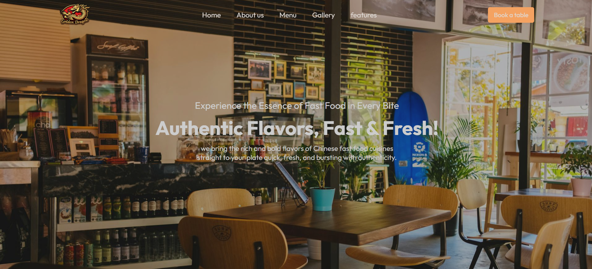
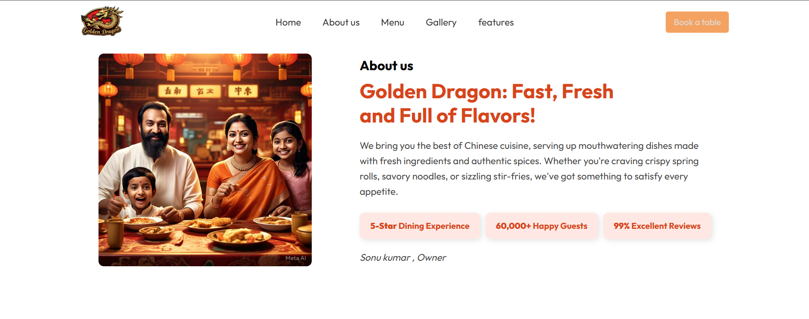
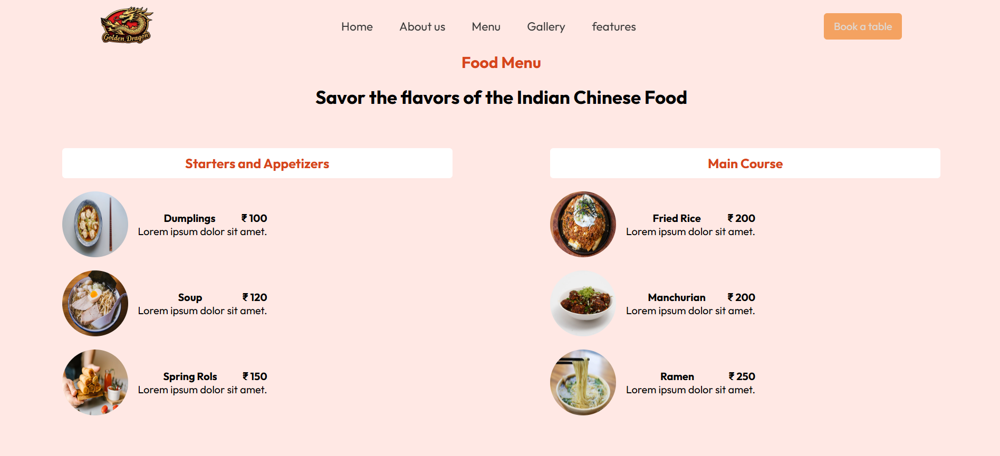
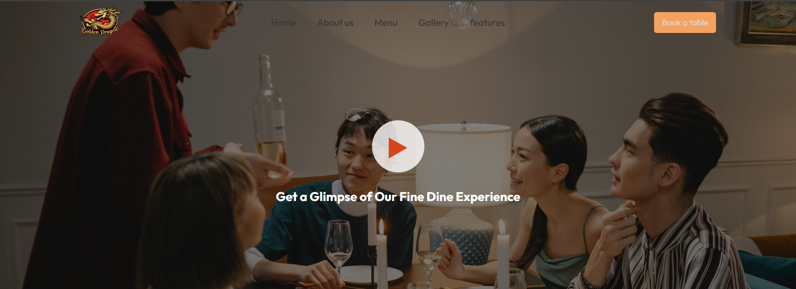
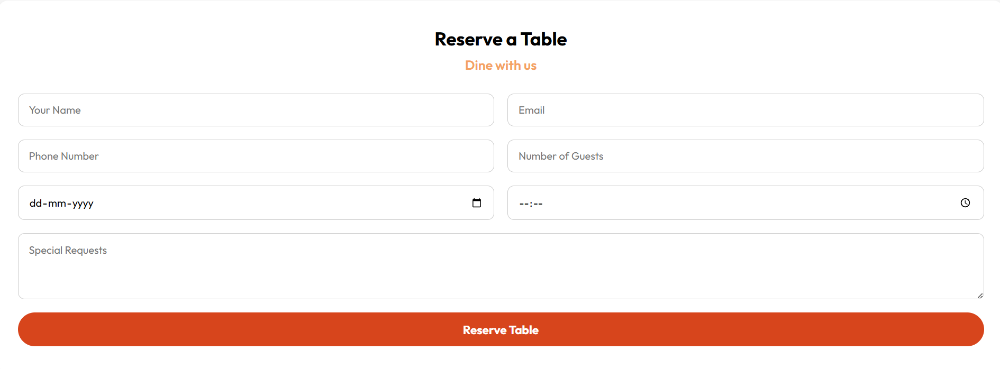

#  🐉 Golden Dragon - Indian Chinese Restaurant Website

Welcome to **Golden Dragon**, a visually rich, single-page restaurant application crafted entirely with **HTML**, **CSS**, and **Vanilla JavaScript**, without using any frontend library or frameworks.  This responsive and elegant website showcases a seamless dining experience online, specially crafted for a fusion-themed **Indian Chinese** restaurant.


## 🌟 Features

- 🍜 **Cuisine Focus:** Authentic Indian-Chinese fusion food.
- 📱 **Responsive Design:** Mobile-first, works smoothly across all devices.
- 🧭 **Smooth Navigation:** Sticky, interactive navbar with intuitive section links.
- 🖼️ **Rich Visuals:** Image gallery and stylish food showcase.
- 📖 **Clean Layout:** Fully structured sections — Home, About Us, Menu, Gallery, Features.
- 🪑 **Book Table CTA:** Prominent "Book Table" button in the navbar for reservations.
- ⚡ **No Library or Framework Used :** Purely built using HTML & CSS and Vanilla Javascript.


## 🖼️Screenshots














## 🛠️ Technologies Used

- **HTML5**
- **CSS3** (Flexbox & Media Queries)
- **Google Fonts**
- **JavaScript**


## 📌 How to Use


1. **Clone the Repository:**

   ``` bash
   git clone https://github.com/your-username/golden-dragon.git
   cd golden-dragon

2. **Open Project in Code Editor.**


3. **Customize the Website:.**

You can personalize the website by editing the following:

- **Text & Sections** in `Home.html`
- **Styles** in `Home.css`
- **Images** in the `Assets/` folder